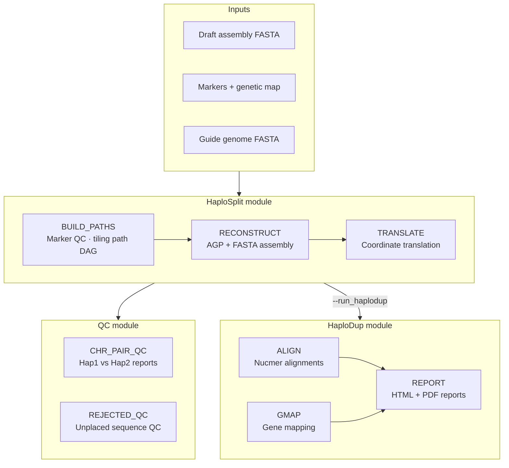
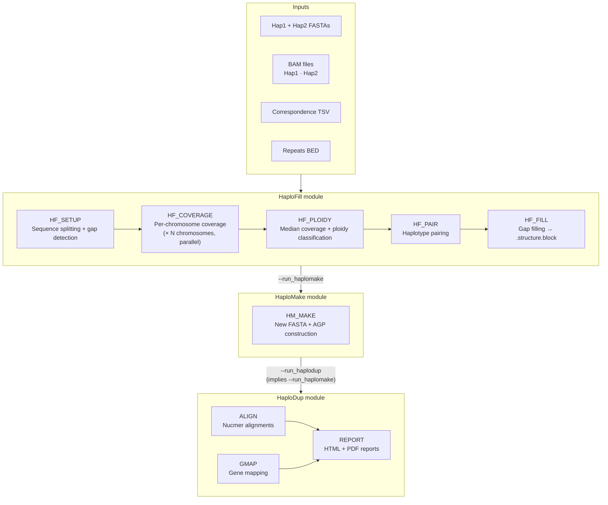

# HaploSync NextFlow pipeline

## Table of contents

- [What's new in this fork (v2.0)](#whats-new-in-this-fork-v20)
- [Assembly curation guide](#assembly-curation-guide)
- [Workflows](#workflows)
  - [1. PM Reconstruction](#1-pm-reconstruction)
  - [2. Gap Filling](#2-gap-filling)
- [Quick start](#quick-start)
  - [Prerequisites](#prerequisites)
  - [PM Reconstruction](#pm-reconstruction)
  - [Gap Filling](#gap-filling)
  - [Using a params file](#using-a-params-file)
  - [Resume after interruption](#resume-after-interruption)
- [HPC execution](#hpc-execution)
- [Nextflow tips](#nextflow-tips)
- [Repository structure](#repository-structure)
- [Citation](#citation)

---

## What's new in this fork (v2.0)

This fork modernises and extends the [original HaploSync v1.0](https://github.com/andreaminio/HaploSync) repository. Key changes include:

### Nextflow implementation
The entire pipeline is reimplemented in [Nextflow DSL2](https://www.nextflow.io/), replacing the previous manual step-by-step execution model. Each tool step is now a declarative process with automatic dependency resolution, caching, and resume support. This means:
- Interrupted runs resume from the last successful step with `-resume`
- Steps run in parallel wherever the data flow allows (e.g., per-chromosome coverage jobs run concurrently)
- Resource allocation (CPUs, memory) is controlled centrally via `nextflow.config`
- HPC execution (SLURM) is supported out of the box with `-profile hpc`

### Python 3 upgrade
The entire codebase is ported from Python 2 to Python 3. All core tools (`HaploSplit.py`, `HaploDup.py`, `HaploFill.py`, `HaploMake.py`) and the shared library (`lib_files/HaploFunct.py`) are fully Python 3 compatible.

### HaploSplit now delegates to HaploDup
When `--run_haplodup` is set, HaploSplit calls `HaploDup.py` directly as a subprocess, eliminating code duplication and keeping both tools in sync.

### Chromosome pair reports generated by default
In HaploDup, chromosome pair overview reports (Hap1 vs Hap2 structure and marker distribution) are now produced automatically. Use `--skip_chr_pair_reports` to suppress them.

### Focused scope
This fork focuses on the two core production workflows — pseudomolecule reconstruction and gap filling. Legacy tools (`HaploBreak`, `HaploMap`) and the original step-by-step manual have been moved to `archives/`.

---

## Assembly curation guide

A complete genome assembly in HaploSync goes through two successive workflows:

1. **PM Reconstruction** (`reconstruct_pm.nf`) — assigns draft contigs/scaffolds to haplotypes, orders and orients them into chromosome-scale pseudomolecules, and produces QC reports.
2. **Gap Filling** (`gap_fill.nf`) — fills assembly gaps in the pseudomolecules using unplaced sequences, then optionally rebuilds the assembly and runs duplication QC.

In practice, neither workflow runs in a single shot. QC reports from PM reconstruction often reveal marker conflicts or chimeric contigs that must be resolved before gap filling. Gap filling is optional and is best done in two passes to evaluate unplaced and homozygous fills separately.

The **[Assembly curation guide](nextflow/docs/curation_guide.md)** walks through the full iterative loop and is the recommended starting point for new assemblies.

> **Start here if you are running HaploSync for the first time on a new assembly.**

---

## Workflows

### 1. PM Reconstruction

Builds chromosome-scale pseudomolecules from draft contig/scaffold assemblies, assigns sequences to haplotypes, and runs QC reports.

**Entry point:** `nextflow/reconstruct_pm.nf`



[Full documentation](nextflow/docs/reconstruct_pm.md) · [HaploDup](nextflow/docs/haplodup.md)

---

### 2. Gap Filling

Fills assembly gaps in existing pseudomolecules using unplaced sequences guided by read coverage, then optionally rebuilds the assembly and runs duplication QC.

**Entry point:** `nextflow/gap_fill.nf`



[Full documentation](nextflow/docs/gap_fill.md) · [HaploMake](nextflow/docs/haplomake.md) · [HaploDup](nextflow/docs/haplodup.md)

---

## Quick start

### Prerequisites

- [Nextflow](https://www.nextflow.io/) ≥ 23.04
- [Conda](https://docs.conda.io/) / [Mamba](https://github.com/mamba-org/mamba) / [Micromamba](https://mamba.readthedocs.io/en/latest/user_guide/micromamba.html)

The conda environment is defined in `nextflow/envs/haplosync.yml` and is activated automatically with `-profile conda` or `-profile mamba`.

### PM Reconstruction

```bash
# With genetic map
nextflow run nextflow/reconstruct_pm.nf -profile mamba \
    --input_fasta assembly.fasta \
    --markers markers.bed --markers_map genetic_map.tsv \
    --out myproject --outdir results

# With guide genome
nextflow run nextflow/reconstruct_pm.nf -profile mamba \
    --input_fasta assembly.fasta \
    --guide_genome reference.fasta --run_alignment \
    --out myproject --outdir results

# With HaploDup QC
nextflow run nextflow/reconstruct_pm.nf -profile mamba \
    --input_fasta assembly.fasta \
    --markers markers.bed --markers_map genetic_map.tsv \
    --run_haplodup \
    --out myproject --outdir results
```

### Gap Filling

```bash
# Gap fill only
nextflow run nextflow/gap_fill.nf -profile mamba \
    --hapfill_hap1 hap1.fasta --hapfill_hap2 hap2.fasta \
    --hapfill_correspondence correspondence.tsv \
    --hapfill_repeats repeats.bed \
    --hapfill_b1 hap1.bam --hapfill_b2 hap2.bam \
    --out myproject --outdir results

# Gap fill + build new assembly + HaploDup QC
nextflow run nextflow/gap_fill.nf -profile mamba \
    --hapfill_hap1 hap1.fasta --hapfill_hap2 hap2.fasta \
    --hapfill_unplaced unplaced.fasta \
    --hapfill_correspondence correspondence.tsv \
    --hapfill_repeats repeats.bed \
    --hapfill_b1 hap1.bam --hapfill_b2 hap2.bam \
    --run_haplodup \
    --out myproject --outdir results
```

### Using a params file

```bash
nextflow run nextflow/reconstruct_pm.nf -profile mamba -params-file params.yml
```

Example param files: `nextflow/params_reconstruct_pm.yml` and `nextflow/params_gap_fill.yml`.

### Resume after interruption

```bash
nextflow run nextflow/reconstruct_pm.nf -profile mamba -resume -params-file params.yml
```

---

## HPC execution

Use `-profile hpc` for SLURM-based cluster execution:

```bash
nextflow run nextflow/reconstruct_pm.nf -profile hpc -params-file params.yml
```

See `nextflow/nextflow.config` for resource configuration (CPUs, memory, queue names).

---

## Nextflow tips

For practical guidance on running Nextflow day to day — resuming runs, reading logs, finding the work directory for a failed task, generating execution reports, and cleaning up — see the **[Nextflow tips](nextflow/docs/nextflow_tips.md)** page.

---

## Repository structure

```
nextflow/
├── reconstruct_pm.nf          # PM Reconstruction entry point
├── gap_fill.nf                # Gap Filling entry point
├── haplomake.nf               # HaploMake standalone entry point
├── haplodup.nf                # HaploDup standalone entry point
├── nextflow.config            # Profiles, resource labels
├── params_reconstruct_pm.yml  # Example params (PM reconstruction)
├── params_gap_fill.yml        # Example params (gap filling)
├── workflows/
│   ├── pseudomolecule_generation.nf   # HAPLOSYNC_RECONSTRUCT_PM sub-workflows
│   └── gap_fill.nf                    # HAPLOSYNC_GAP_FILL sub-workflows
├── modules/local/
│   ├── build_paths/           # HaploSplit: tiling path selection
│   ├── reconstruct/           # HaploSplit: AGP + FASTA assembly
│   ├── translate/             # HaploSplit: coordinate translation
│   ├── chr_pair_qc/           # QC: chromosome pair reports
│   ├── rejected_qc/           # QC: unplaced sequence QC
│   ├── haplodup_align/        # HaploDup: nucmer alignments
│   ├── haplodup_gmap/         # HaploDup: GMAP gene mapping
│   ├── haplodup_report/       # HaploDup: HTML + PDF reports
│   ├── hapfill_setup/         # HaploFill: sequence splitting
│   ├── hapfill_coverage/      # HaploFill: per-chromosome coverage
│   ├── hapfill_ploidy/        # HaploFill: ploidy classification
│   ├── hapfill_pair/          # HaploFill: haplotype pairing
│   ├── hapfill_fill/          # HaploFill: gap filling
│   └── hapmake/               # HaploMake: new assembly construction
├── docs/
│   ├── reconstruct_pm.md      # PM Reconstruction full documentation
│   ├── gap_fill.md            # Gap Filling full documentation
│   ├── haplomake.md           # HaploMake documentation
│   ├── haplodup.md            # HaploDup documentation
│   ├── curation_guide.md      # Assembly curation guide
│   └── nextflow_tips.md       # Nextflow practical tips
└── envs/
    └── haplosync.yml          # Conda environment

HaploSplit.py                  # PM reconstruction core tool
HaploDup.py                    # Haplotype duplication QC core tool
HaploFill.py                   # Gap filling core tool
HaploMake.py                   # Assembly construction core tool
lib_files/                     # Shared Python libraries
scripts/                       # Nextflow module wrapper scripts
support_scripts/               # R/Rmd report templates
archives/                      # Legacy scripts and documentation
```

---

## Citation

**Assembly of complete diploid-phased chromosomes from draft genome sequences**
Andrea Minio, Noé Cochetel, Amanda M Vondras, Mélanie Massonnet, Dario Cantu
*G3 Genes|Genomes|Genetics*, Volume 12, Issue 8, August 2022, jkac143
https://doi.org/10.1093/g3journal/jkac143
