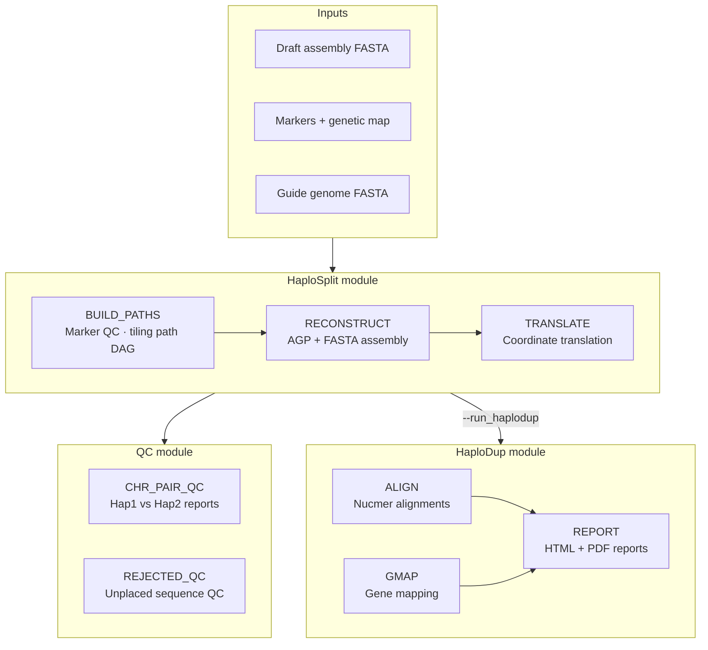
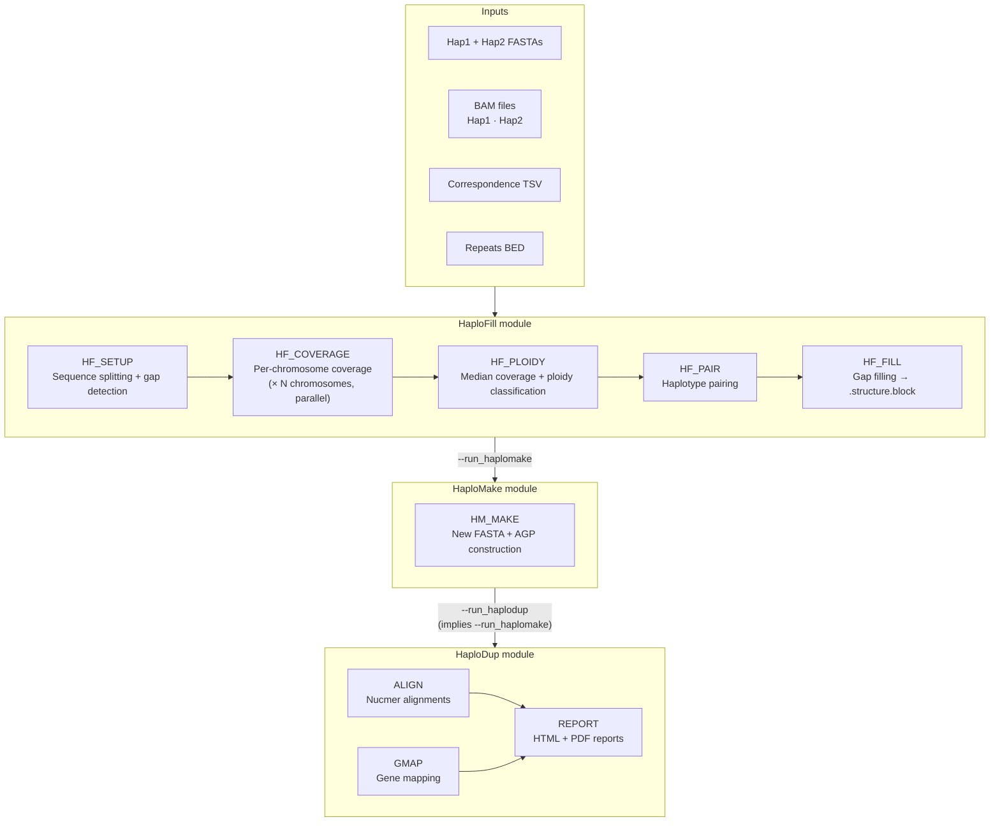

# HaploSync Nextflow pipeline

[](https://github.com/noecochetel/HaploSync/actions/workflows/linting.yml)
[](https://github.com/noecochetel/HaploSync/actions/workflows/nf-test.yml)
[](https://nf-co.re/tools)
[](https://www.nextflow.io/)
[](https://docs.conda.io/en/latest/)
[](LICENSE)

## Documentation map

New to HaploSync? Read in this order:

1. **[Quick start](#quick-start)** below — install prerequisites and run your first command, or try the bundled test genome.
2. **[Assembly curation guide](nextflow/docs/curation_guide.md)** — the full iterative workflow for a real assembly, from draft contigs to a curated, gap-filled genome. Start here once you have real data.
3. **[docs/usage.md](docs/usage.md)** — the `--step` / `-entry` CLI reference: what each mode does and when to use it.
4. **[nextflow/docs/reconstruct_pm.md](nextflow/docs/reconstruct_pm.md)** and **[nextflow/docs/gap_fill.md](nextflow/docs/gap_fill.md)** — full parameter reference for each stage, including the params-file templates to copy instead of typing flags inline.

Everything below expands on these four, in the same order.

## Table of contents

- [What's new in this fork (v2.0)](#whats-new-in-this-fork-v20)
- [Quick start](#quick-start)
  - [Prerequisites](#prerequisites)
  - [reconstruct_pm](#reconstruct_pm)
  - [gap_fill](#gap_fill)
  - [Using a params file](#using-a-params-file)
  - [Resume after interruption](#resume-after-interruption)
  - [Running the bundled test genome](#running-the-bundled-test-genome)
- [Assembly curation guide](#assembly-curation-guide)
- [Pipeline stages](#pipeline-stages)
  - [1. `--step reconstruct_pm`](#1---step-reconstruct_pm)
  - [2. `--step gap_fill`](#2---step-gap_fill)
- [Nextflow tips](#nextflow-tips)
- [Repository structure](#repository-structure)
- [Citation](#citation)

---

## What's new in this fork (v2.0)

This fork modernises and extends the [original HaploSync v1.0](https://github.com/andreaminio/HaploSync) repository. Key changes include:

### Nextflow implementation

The entire pipeline is reimplemented in [Nextflow DSL2](https://www.nextflow.io/), replacing the previous manual step-by-step execution model. Each tool step is now a declarative process with automatic dependency resolution, caching, and resume support. This means:

- Interrupted runs resume from the last successful step with `-resume`
- Steps run in parallel wherever the data flow allows (e.g., per-chromosome coverage jobs run concurrently)
- Resource allocation (CPUs, memory) is controlled centrally via `conf/base.config`

### Single, nf-core-structured entry point

The pipeline follows [nf-core](https://nf-co.re/) pipeline conventions: one `main.nf` at the repo root, `nextflow_schema.json` parameter validation, standardised `conf/` profiles, and a bundled tiny synthetic test genome under `test_data/` that lets `nf-core pipelines lint` and `nf-test` run without any external data. Because HaploSplit's tiling-path output almost always needs manual curation before gap-filling (see below), the two stages are selected with a single `--step` parameter rather than separate scripts, following the same pattern [nf-core/sarek](https://nf-co.re/sarek) uses for its own staged, resumable workflow.

### Python 3 upgrade

The entire codebase is ported from Python 2 to Python 3. All core tools (`HaploSplit.py`, `HaploDup.py`, `HaploFill.py`, `HaploMake.py`) and the shared library (`bin/lib_files/HaploFunct.py`) are fully Python 3 compatible, and now live under `bin/` (Nextflow's convention for pipeline-callable scripts).

### Focused scope

This fork focuses on the two core production workflows — pseudomolecule reconstruction and gap filling. Legacy tools (`HaploBreak`, `HaploMap`) and the original step-by-step manual have been moved to `archives/`. HaploMake's legacy overlap-dodging alignment search has been retired; the former `--skipoverlap` behavior (insert components separated by a plain gap, no overlap trimming) is now the only, default behavior.

---

## Quick start

### Prerequisites

- [Nextflow](https://www.nextflow.io/) ≥ 25.04.0 (required by the `nf-schema` plugin)
- [Conda](https://docs.conda.io/) / [Mamba](https://github.com/mamba-org/mamba) / [Micromamba](https://mamba.readthedocs.io/en/latest/user_guide/micromamba.html)

The conda environment is defined in `nextflow/envs/haplosync.yml` and is activated automatically with `-profile conda` or `-profile mamba`.

### reconstruct_pm

```bash
# With genetic map
nextflow run . -profile mamba --step reconstruct_pm \
    --input_fasta assembly.fasta \
    --markers markers.bed --markers_map genetic_map.tsv \
    --out myproject --outdir results

# With guide genome
nextflow run . -profile mamba --step reconstruct_pm \
    --input_fasta assembly.fasta \
    --guide_genome reference.fasta --run_alignment \
    --out myproject --outdir results

# With HaploDup QC
nextflow run . -profile mamba --step reconstruct_pm \
    --input_fasta assembly.fasta \
    --markers markers.bed --markers_map genetic_map.tsv \
    --run_haplodup \
    --out myproject --outdir results
```

### gap_fill

```bash
# Gap fill only
nextflow run . -profile mamba --step gap_fill \
    --hapfill_hap1 hap1.fasta --hapfill_hap2 hap2.fasta \
    --hapfill_correspondence correspondence.tsv \
    --hapfill_repeats repeats.bed \
    --hapfill_b1 hap1.bam --hapfill_b2 hap2.bam \
    --out myproject --outdir results

# Gap fill + build new assembly + HaploDup QC
nextflow run . -profile mamba --step gap_fill \
    --hapfill_hap1 hap1.fasta --hapfill_hap2 hap2.fasta \
    --hapfill_unplaced unplaced.fasta \
    --hapfill_correspondence correspondence.tsv \
    --hapfill_repeats repeats.bed \
    --hapfill_b1 hap1.bam --hapfill_b2 hap2.bam \
    --run_haplodup \
    --out myproject --outdir results
```

### Using a params file

```bash
nextflow run . -profile mamba --step reconstruct_pm -params-file params.yml
```

Recommended over passing every flag inline. Copy one of these as a starting point and edit the paths: `nextflow/params_reconstruct_pm.yml` and `nextflow/params_gap_fill.yml`.

### Resume after interruption

```bash
nextflow run . -profile mamba --step reconstruct_pm -resume -params-file params.yml
```

### Running the bundled test genome

A tiny (~10 kb) synthetic diploid genome is bundled under `test_data/` specifically to exercise both stages end-to-end in seconds, including a deliberately-injected gap that HaploFill must fill correctly:

```bash
nextflow run . -profile test,mamba --outdir results_pm
nextflow run . -profile test_gapfill,mamba --outdir results_gf
```

or via `nf-test test` (see [docs/usage.md](docs/usage.md)).

---

## Assembly curation guide

A complete genome assembly in HaploSync goes through two successive stages:

1. **`--step reconstruct_pm`** — assigns draft contigs/scaffolds to haplotypes, orders and orients them into chromosome-scale pseudomolecules, and produces QC reports.
2. **`--step gap_fill`** — fills assembly gaps in the pseudomolecules using unplaced sequences, then optionally rebuilds the assembly and runs duplication QC.

In practice, neither stage runs in a single shot, and Nextflow can't pause mid-run for a human to look at anything — so the workflow is: run `--step reconstruct_pm`, inspect/edit `results/HaploSplit/*` by hand (fixing marker conflicts, chimeric contigs, tiling paths), then run `--step gap_fill` pointing at the (possibly edited) files. Gap filling is optional and is best done in two passes to evaluate unplaced and homozygous fills separately.

The **[Assembly curation guide](nextflow/docs/curation_guide.md)** walks through the full iterative loop and is the recommended starting point once you have a real assembly to curate. See also **[docs/usage.md](docs/usage.md)** for the `--step` interface itself.

---

## Pipeline stages

### 1. `--step reconstruct_pm`

Builds chromosome-scale pseudomolecules from draft contig/scaffold assemblies, assigns sequences to haplotypes, and runs QC reports.


```mermaid
flowchart TD
    subgraph IN["Inputs"]
        I1[Draft assembly FASTA]
        I2[Markers + genetic map]
        I3[Guide genome FASTA]
    end

    subgraph HS["HaploSplit module"]
        S1[BUILD_PATHS\nMarker QC · tiling path DAG]
        S2[RECONSTRUCT\nAGP + FASTA assembly]
        S3[TRANSLATE\nCoordinate translation]
        S1 --> S2 --> S3
    end

    subgraph QC["QC module"]
        Q1[CHR_PAIR_QC\nHap1 vs Hap2 reports]
        Q2[REJECTED_QC\nUnplaced sequence QC]
    end

    subgraph HD["HaploDup module"]
        D1[ALIGN\nNucmer alignments]
        D2[GMAP\nGene mapping]
        D3[REPORT\nHTML + PDF reports]
        D1 --> D3
        D2 --> D3
    end

    IN --> HS
    HS --> QC
    HS -->|"--run_haplodup"| HD
```

[Full documentation](nextflow/docs/reconstruct_pm.md) · [HaploDup](nextflow/docs/haplodup.md)

---

### 2. `--step gap_fill`

Fills assembly gaps in existing pseudomolecules using unplaced sequences guided by read coverage, then optionally rebuilds the assembly and runs duplication QC.


```mermaid
flowchart TD
    subgraph IN["Inputs"]
        I1[Hap1 + Hap2 FASTAs]
        I2[BAM files\nHap1 · Hap2]
        I3[Correspondence TSV]
        I4[Repeats BED]
    end

    subgraph HF["HaploFill module"]
        F1[HF_SETUP\nSequence splitting + gap detection]
        F2["HF_COVERAGE\nPer-chromosome coverage\n(× N chromosomes, parallel)"]
        F3[HF_PLOIDY\nMedian coverage + ploidy classification]
        F4[HF_PAIR\nHaplotype pairing]
        F5[HF_FILL\nGap filling → .structure.block]
        F1 --> F2 --> F3 --> F4 --> F5
    end

    subgraph HM["HaploMake module"]
        M1[HM_MAKE\nNew FASTA + AGP construction]
    end

    subgraph HD["HaploDup module"]
        D1[ALIGN\nNucmer alignments]
        D2[GMAP\nGene mapping]
        D3[REPORT\nHTML + PDF reports]
        D1 --> D3
        D2 --> D3
    end

    IN --> HF
    HF -->|"--run_haplomake"| HM
    HM -->|"--run_haplodup\n(implies --run_haplomake)"| HD
```

[Full documentation](nextflow/docs/gap_fill.md) · [HaploMake](nextflow/docs/haplomake.md) · [HaploDup](nextflow/docs/haplodup.md)

---

## Nextflow tips

For practical guidance on running Nextflow day to day — resuming runs, reading logs, finding the work directory for a failed task, generating execution reports, and cleaning up — see the **[Nextflow tips](nextflow/docs/nextflow_tips.md)** page.

---

## Repository structure

```
main.nf                        # Single entry point, dispatches on --step
nextflow.config                 # Manifest, params, profiles, plugins
nextflow_schema.json             # Parameter schema (nf-schema validation)
conf/
├── base.config                # Resource labels (process_low/medium/high)
├── modules.config             # Per-process module configuration
├── test.config                # -profile test (reconstruct_pm, tiny genome)
└── test_gapfill.config        # -profile test_gapfill (gap_fill, fixture data)
workflows/
└── haplosync.nf                # Composable sub-workflows for both stages
bin/                            # Pipeline-callable scripts (on $PATH for every process)
├── HaploSplit.py / HaploDup.py / HaploFill.py / HaploMake.py   # Core tools
├── build_paths.py, reconstruct.py, translate.py, ...           # Module wrapper scripts
└── lib_files/                 # Shared Python libraries
nextflow/
├── modules/local/              # Nextflow process definitions (one dir per tool step)
├── envs/haplosync.yml          # Conda environment
├── docs/                       # Detailed per-stage documentation
└── params_*.yml                # Example params files
test_data/                      # Bundled tiny synthetic genome + gap_fill fixtures
tests/                          # nf-test suite
docs/                           # usage.md / output.md (nf-core convention)
support_scripts/                # R/Rmd report templates
archives/                       # Legacy scripts and documentation
```

---

## Citation

**Assembly of complete diploid-phased chromosomes from draft genome sequences**
Andrea Minio, Noé Cochetel, Amanda M Vondras, Mélanie Massonnet, Dario Cantu
*G3 Genes|Genomes|Genetics*, Volume 12, Issue 8, August 2022, jkac143
https://doi.org/10.1093/g3journal/jkac143

See also [CITATIONS.md](CITATIONS.md) for the tools this pipeline depends on.
