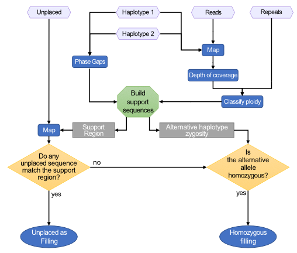

# HaploFill

HaploFill uses unplaced sequences to fill haplotype-specific gaps produced during the assembly or pseudomolecule reconstruction procedures. When gaps in diploid regions cannot be filled with unplaced sequences, the alternative haplotype is used to fill the unassembled region.

## Usage

```
usage: HaploFill.py [-h] [-1 Hap1.fasta] [-2 Hap2.fasta] [-U Unplaced.fasta]
                    [-c Hap1_to_Hap2.txt] [--exclusion exclusion_list.tsv]
                    [--known known.tsv] [-r repeats.bed]
                    [--repeats_format [BED|GFF3|GFF|GTF]] [-o outprefix]
                    [--C12 cov1.txt] [--C1 cov1.txt] [--C2 cov2.txt] [-C]
                    [-s reads.fastq.gz] [--map_threads N]
                    [--sequencing_technology [PacBio|ONT|Illumina_pe|Illumina_se]]
                    [--b1 reads.on.hap1.bam] [--b2 reads.on.hap2.bam] [-e 100]
                    [-t path/to/tmp] [--resume N] [--stop N] [--overwrite]
                    [--flanking N] [--coverage N] [--nohomozygous]
```

## Input and Arguments

#### Required

* `-1 | --hap1`: FASTA sequences of the first haplotype.
* `-2 | --hap2`: FASTA sequences of the second haplotype.
* `-U | --unplaced`: FASTA sequences of the unplaced sequences.
* `-c | --haplotype_correspondence`: Tabular text file that relates sequences between the two haplotypes.
* `-r | --repeats`: `BED`, `GFF3`, `GFF`, or `GTF` annotation file of repetitive sequences.

One set of parameters is also required for coverage analysis. Choose one of:

* Pre-computed per-base coverage files:
  * Single file with both haplotypes: `--C12 | --Coverage12`
  * Separate files per haplotype: `--C1 | --Coverage1` and `--C2 | --Coverage2`
* Calculate coverage from reads: `-C | --calculate_coverage` and `-s | --sequenced_reads`
* Calculate coverage from existing alignments: `-C | --calculate_coverage`, `--b1`, and `--b2`

#### Coverage flags

* `--C12 | --Coverage12`: Per-base sequencing coverage of both haplotypes in a single file.
  * Obtained with: `bedtools genomecov -d -ibam`
* `--C1 | --Coverage1`: Per-base sequencing coverage of haplotype 1.
  * Obtained with: `bedtools genomecov -d -ibam`
* `--C2 | --Coverage2`: Per-base sequencing coverage of haplotype 2.
  * Obtained with: `bedtools genomecov -d -ibam`
* `-C | --calculate_coverage`: Run coverage calculation from reads or alignments.
  * *default: false*
* `-s | --sequenced_reads`: Sequenced reads in FASTA or FASTQ format. Gzipped (`.gz`) files are accepted. Required when `-C` is set without `--b1`/`--b2`.
* `--b1`: Alignment of reads on the first haplotype in BAM format. Required when `-C` is set without `-s`.
* `--b2`: Alignment of reads on the second haplotype in BAM format. Required when `-C` is set without `-s`.

#### Optional

* `--repeats_format [BED|GFF3|GFF|GTF]`: Format of the repeat annotation file.
  * *default: `BED`*
* `--exclusion exclusion_list.tsv`: Tab-separated file of unplaced sequences incompatible with a given input pseudomolecule.
* `--known known.tsv`: Tab-separated file of unplaced sequences with a known pseudomolecule association.
* `-o | --output`: Prefix for output file names.
  * *default: `out`*
* `--sequencing_technology [PacBio|ONT|Illumina_pe|Illumina_se]`: Sequencing technology used for reads passed to `-s`.
  * *default: `PacBio`*
  * Choices: `PacBio`, `ONT`, `Illumina_pe`, `Illumina_se`
* `--map_threads N`: Number of threads for mapping.
  * *default: `4`*
* `-e | --expected_coverage N`: Expected haploid coverage threshold for local ploidy evaluation. If not set, the median coverage is calculated and used.
  * *default: median*
* `--coverage N`: Minimum percentage of the filler sequence that must align to the support sequence(s) for a match to be accepted.
  * *default: `20`*
* `--nohomozygous`: Do not search for or output homozygous fillers (i.e. skip filling gaps using the alternative haplotype when no unplaced sequence is found).
* `-t | --temp`: Path to temporary folder. Required if resuming a previous run.
  * *default: `./tmp_HaploFill`*
* `--resume N`: Resume processing from step N (1–6).
* `--stop N`: Stop processing after step N (1–6).
* `--overwrite`: Force overwrite of content in the temporary folder.
* `--flanking N`: Size (in bp) of the flanking region around gaps used to build support sequences.
  * *default: `150000` (150 kb)*

## Workflow control

HaploFill may take a long time to run. The user can control each step of the procedure and recover from interruptions.

* Steps already completed successfully are automatically skipped.
* `--resume N` and `--stop N` control from which step to start and at which step to stop, respectively.
* Some steps (alignment, coverage calculation) are run with external tools. HaploFill saves their results in the temporary folder (default: `./tmp_HaploFill`) so they can be reused. To recover a previous run, provide the same temporary folder path via `-t | --temp`.
* The temporary folder contains a control file `status.json` that tracks the status of each sub-step:

  ```json
  {
   "1-setup": {
       "1.1-split": "DONE",
       "1.2-pairs": "DONE",
       "1.3-repeat": "DONE",
       "1.4-gap": "DONE"
   },
   "2-coverage": {
       "2.1-map1": "TODO",
       "2.2-map2": "TODO",
       "2.3-cov1": "TODO",
       "2.4-cov2": "TODO",
       "2.5-split": "TODO"
   },
   "3-ploidy": {
       "3.1-median": "TODO",
       "3.2-categorize": "TODO"
   },
   "4-hap2hap": {
       "4.1-map": "TODO",
       "4.2-uniquify": "TODO",
       "4.3-pairing": "TODO"
   },
   "5-upgradeable": {
       "5.1-Unmatched": "TODO",
       "5.2-preprocess_gaps": "TODO",
       "5.3-get_sequences": "TODO"
   },
   "6-filling": {
       "6.1-gather": "TODO",
       "6.2-map": "TODO",
       "6.3-select": "TODO"
   }
  }
  ```

  * `TODO`: step has not yet been run.
  * `DONE`: step completed successfully and will be skipped on re-run.
  * To force a step to re-run, change its status back to `TODO`. Re-running all downstream steps is recommended to avoid inconsistencies.

## Output

* Standard output: logs the status of the procedure with timestamps.
* Standard error: details the processes running and summarises results for QC and debugging.
* `tmp_HaploFill/`: Temporary folder containing all intermediate data and the `status.json` control file needed to resume or re-run the analysis.
* `out.gap_filling_findings.txt`: Summary of results for each gap in the sequence.
* `out.structure.block`: [BLOCK](../block_format.md) file describing the expected pseudomolecule structure after gap filling.

## How it works

Generally, pseudomolecules are the result of scaffolding or the juxtaposition of sequences. These procedures leave gaps in sequence that require filling to recover lost or missing information. Gaps present in the pseudomolecules produced by HaploSplit can have two different origins:

* **Placeholders between legacy sequences**: HaploSplit adds gaps where unknown content is expected between adjacent sequences. These gaps are a user-defined fixed length.

* **Gaps due to previous assembly procedures**: Gaps in the legacy sequences used as input for HaploSplit are inherited in final pseudomolecules unless broken by HaploBreak. Gap lengths may vary based on the scaffolding approach used.

The filling procedure considers gap characteristics because the nature of the missing information is non-uniform.

* **Repetitive content**: Short reads (e.g. Illumina) are not well-suited to reconstructing repetitive elements. Filling repetitive regions is impractical and error-prone due to ambiguity in the assembly graph.

* **Placeholder sequences**: Hybrid scaffolding (e.g. BioNano optical maps) can produce large gaps when insufficient markers are available to place a sequence. The alternative haplotype and flanking regions can help retrieve the missing information. HaploSplit inherits these gaps and cannot fill them; sequences that would serve as fillers remain unplaced. HaploFill recovers them by comparing the two haplotypes.

* **Haploid representation of homozygous sequences**: When a diploid-aware assembler (e.g. FALCON-Unzip) cannot distinguish haplotypes in homozygous regions, haplotigs are left incomplete. These gaps can be filled using the alternative allele. Use `--nohomozygous` to disable this behaviour.

* **Unmatched information in the reference**: HaploSplit uses reference information to bin sequences by chromosome. Divergent regions without positional information remain unplaced. A direct comparison of the two pseudomolecules can recover divergent structure from the alternative haplotype.



### HaploFill Procedure

1. **Determine the nature of each gap:**
  1. Calculate sequencing coverage of each pseudomolecule.
     * **Reads only**: aligns reads and extracts per-base coverage depth.
     * **BAM files**: processes alignments and calculates per-base coverage depth.
     * **Pre-computed coverage**: imports results directly.
  2. Evaluate the ploidy/repetitivity status of each region:
     * Smooth the depth of coverage.
     * Classify each region based on the expected haploid depth (user-defined or derived from the median):
       * coverage ≤ (median × 0.1): Uncovered
       * (median × 0.1) < coverage ≤ (median × 0.6): Haploid
       * (median × 0.6) < coverage < (median × 2.4): Diploid
       * coverage ≥ (median × 2.4): Repetitive / too high
  3. For each gap, identify the corresponding region on the alternative haplotype:
     * Extract sequences and ploidy for the flanking regions and the opposite region on the alternative haplotype.
     * Discard regions that are unreliable for mapping support (>75% gaps, >75% repeats/high coverage).
     * Build support sequences:
       * If the opposite region is reliable: build a hybrid support (gap flanks + opposite region) and an alternative support (opposite region + its own flanks).
       * If the opposite region is not reliable: build a gap support (gap flanks only) and an alternative support.

2. **Map unplaced sequences** on all support regions and find the best match to each support region.

3. **Validate matches** and keep the best filler according to priority:
  * Hybrid support region filler.
  * Alternative support region filler.
  * Gap support region filler.

4. **Homozygous filler for unpatched gaps**: if no filler validates and the region corresponding to the gap on the alternative haplotype is diploid, report that region as filler. Disabled by `--nohomozygous`.
