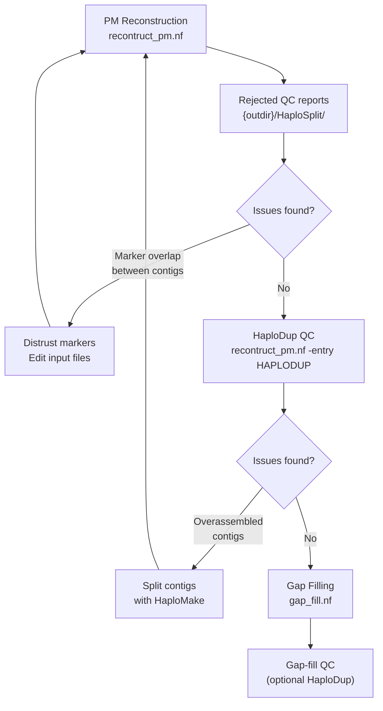

# Assembly curation guide

This guide describes the iterative curation process between the two main HaploSync workflows: PM reconstruction and gap filling. Assembly curation typically requires multiple rounds of inspection and correction before a polished result is achieved.

---

## Overview



---

## Step 1 — PM reconstruction

Run the PM reconstruction workflow on your draft assembly:

```bash
nextflow run nextflow/reconstruct_pm.nf -profile mamba \
    --input_fasta assembly.fasta \
    --markers markers.bed \
    --markers_map genetic_map.tsv \
    --out myproject --outdir results
```

---

## Step 2 — Inspect rejected QC reports

The rejected QC reports are the first stop after reconstruction. They show sequences that were assigned to a chromosome but could not be incorporated into the pseudomolecule.

**Reports location:** `{outdir}/HaploSplit/*.rejected_qc.html`

### What to look for

Each report shows one sequence aligned against the pseudomolecule it was assigned to. Common issues:

#### Marker overlap between contigs

**Symptom:** A sequence gets assigned to a chromosome but is rejected from the tiling path because it conflicts with an already-placed sequence.

**Cause:** The sequence has markers that overlap with markers already placed in the pseudomolecule. Only one contig can be placed; the other is rejected.

**Fix:**
1. Identify the conflicting marker(s) from the report
2. Remove or flag those markers in your input marker BED file — "distrust" them so HaploSplit ignores them when building the tiling path
3. Re-run PM reconstruction with `-resume`:

```bash
nextflow run nextflow/reconstruct_pm.nf -profile mamba -resume \
    --markers markers.bed \
    --markers_map curated_genetic_map.tsv \
    --out myproject --outdir results
```

Repeat until the rejected QC reports are clean or only contain expected/acceptable cases.

---

## Step 3 — Inspect HaploDup QC reports

Once rejected QC reports are resolved, run HaploDup to check for structural issues in the assembly:

```bash
nextflow run nextflow/haplodup.nf -profile mamba \
    --hap1_fasta results/HaploSplit/myproject.1.fasta \
    --hap2_fasta results/HaploSplit/myproject.2.fasta \
    --correspondence results/HaploSplit/myproject.correspondence.tsv \
    --gff3 annotation.gff3 \
    --out myproject --outdir results
```

**Reports location:** `{outdir}/HaploDup/{out}.HaploDup_dir/`

### What to look for

#### Overassembled contigs (chimeric sequences)

**Symptom:** A dotplot shows a single contig spanning two clearly distinct chromosomal regions — a break point is visible where the contig switches from aligning to one region to aligning to another. Gene content in the window around the breakpoint is imbalanced between haplotypes. Read coverage (to perform independently) does not support the junction.

**Cause:** Two originally separate sequences were incorrectly joined during assembly (chimeric contig). When placed in a pseudomolecule, this produces an artifactual join.

**Fix:** Split the contig at the breakpoint using HaploMake, then re-run PM reconstruction with the split sequences.

1. Identify the breakpoint coordinates from the dotplot
2. Edit the AGP from HaploSplit to split the contig at the breakpoint, then run HaploMake:

```bash
nextflow run nextflow/haplomake.nf -profile mamba \
    --fasta assembly.fasta \
    --structure_block assembly_corrected.agp \
    --hapmake_format AGP \
    --hapmake_prefix NEW \
    --out assembly_split --outdir results_split
```

3. Use the split FASTA as input for the next PM reconstruction round:

```bash
nextflow run nextflow/reconstruct_pm.nf -profile mamba \
    --input_fasta assembly_split.fasta \
    --markers markers_curated.bed \
    --markers_map genetic_map.tsv \
    --out myproject_v2 --outdir results_v2
```

4. Return to Step 2 and inspect the new rejected QC reports and/or the new HaploDup reports.

---

## Step 4 — Gap filling

Once the assembly structure is satisfactory (clean rejected QC, no chimeric contigs in HaploDup), proceed to gap filling. This step is optional, it usually helps placing long unplaced sequences that do not bear any marker and can patch a haplotype by using the structural information from the alternative haplotype.

```bash
nextflow run nextflow/gap_fill.nf -profile mamba \
    --hapfill_hap1 results/HaploSplit/myproject.1.fasta \
    --hapfill_hap2 results/HaploSplit/myproject.2.fasta \
    --hapfill_unplaced results/HaploSplit/myproject.Un.fasta \
    --hapfill_correspondence results/HaploSplit/myproject.correspondence.tsv \
    --hapfill_repeats repeats.bed \
    --hapfill_b1 hap1.bam --hapfill_b2 hap2.bam \
    --run_haplomake \
    --out myproject_gapfilled --outdir results_gapfilled
```

> **Note — two-pass gap filling with `--nohomozygous`**
>
> On the first run, add `--hapfill_nohomozygous` to restrict filling to unplaced sequences only (homozygous filling is skipped). Review the results to check that the unplaced fills are acceptable. Once satisfied, re-run **without** `--hapfill_nohomozygous` to allow HaploFill to also fill gaps using homozygous regions from the opposite haplotype.
>
> This two-pass approach makes it easier to evaluate the two filling strategies independently and gives you control over what gets incorporated into the final assembly.

Make sure to run HaploDup on the gap-filled assembly to verify the fills did not introduce structural artefacts:

```bash
nextflow run nextflow/gap_fill.nf -profile mamba \
    ... \
    --run_haplodup \
    --out myproject_gapfilled --outdir results_gapfilled
```

---

## Quick reference

| Issue | Where seen | Fix |
|-------|-----------|-----|
| Marker overlap between contigs | Rejected QC HTML | Distrust the shared marker(s); re-run HaploSplit |
| Overassembled (chimeric) contig | HaploDup dotplot | Split at breakpoint with HaploMake; re-run HaploSplit |
| Gap unfilled after gap filling | `.structure.block` / HaploDup | Check unplaced sequences and coverage thresholds |
