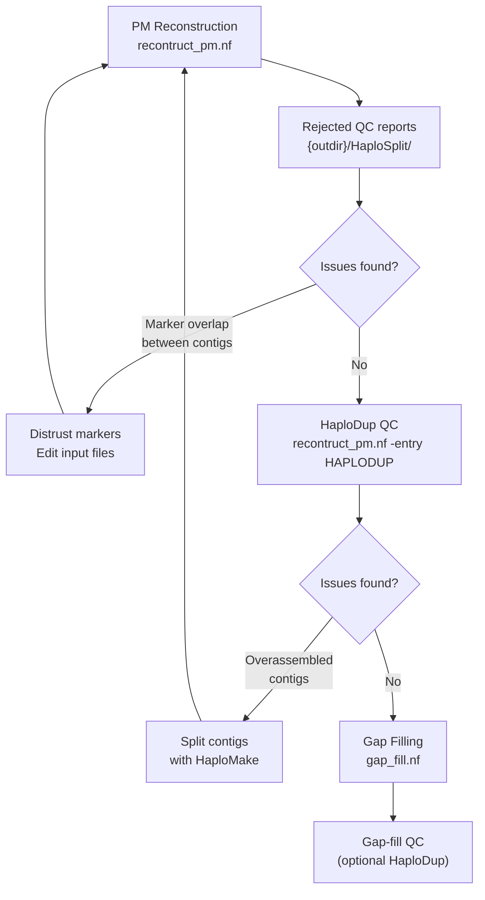

# Assembly curation guide

This guide describes the iterative curation process between the two main HaploSync workflows: PM reconstruction and gap filling. Assembly curation typically requires multiple rounds of inspection and correction before a polished result is achieved.

---

## Overview



---

## Step 1 — PM reconstruction

Run the PM reconstruction workflow on your draft assembly:

```bash
nextflow run nextflow/reconstruct_pm.nf -profile mamba \
    --input_fasta assembly.fasta \
    --markers markers.bed \
    --markers_map genetic_map.tsv \
    --out myproject --outdir results
```

---

## Step 2 — Inspect rejected QC reports

The rejected QC reports are the first stop after reconstruction. They show sequences that were assigned to a chromosome but could not be incorporated into the pseudomolecule — these are the most frequent source of assembly issues.

**Reports location:** `{outdir}/HaploSplit/*.rejected_qc.html`

### What to look for

Each report shows one sequence aligned against the pseudomolecule it was assigned to. Common issues:

#### Marker overlap between contigs

**Symptom:** A sequence has markers that overlap with markers already placed in the pseudomolecule. It gets assigned to the chromosome but rejected from the tiling path because it conflicts with an already-placed sequence.

**Cause:** The overlapping markers often come from a multi-copy gene family. The same locus (e.g., a tandemly duplicated gene) is detected on two different contigs, causing HaploSplit to believe they belong to the same chromosomal region. Only one contig can be placed; the other is rejected.

**Fix:**
1. Identify the conflicting marker(s) from the report
2. Remove or flag those markers in your input marker BED file — "distrust" them so HaploSplit ignores them when building the tiling path
3. Re-run PM reconstruction with `-resume`:

```bash
nextflow run nextflow/reconstruct_pm.nf -profile mamba -resume \
    --markers markers_curated.bed \
    --markers_map genetic_map.tsv \
    --out myproject --outdir results
```

Repeat until the rejected QC reports are clean or only contain expected/acceptable cases.

---

## Step 3 — Inspect HaploDup QC reports

Once rejected QC reports are resolved, run HaploDup to check for structural issues in the assembly:

```bash
nextflow run nextflow/reconstruct_pm.nf -entry HAPLODUP -profile mamba \
    --out myproject --outdir results \
    --gff3 annotation.gff3
```

**Reports location:** `{outdir}/HaploDup/{out}.HaploDup_dir/`

### What to look for

#### Overassembled contigs (chimeric sequences)

**Symptom:** A dotplot shows a single contig spanning two clearly distinct chromosomal regions — a break point is visible where the contig switches from aligning to one region to aligning to another. Gene content in the window around the breakpoint is imbalanced between haplotypes.

**Cause:** Two originally separate sequences were incorrectly joined during assembly (chimeric contig). When placed in a pseudomolecule, this produces an artifactual join.

**Fix:** Split the contig at the breakpoint using HaploMake, then re-run PM reconstruction with the split sequences.

1. Identify the breakpoint coordinates from the dotplot
2. Edit the AGP or write a structure block describing the split:

```
# Option A — edit the AGP from HaploSplit to split the contig
# Add a new row splitting the chimeric sequence at the breakpoint
# Then run HaploMake in AGP mode:

python3 HaploMake.py \
    -f assembly.fasta \
    -s assembly_corrected.agp \
    --format AGP \
    -o assembly_split \
    -p NEW
```

3. Use the split FASTA as input for the next PM reconstruction round:

```bash
nextflow run nextflow/reconstruct_pm.nf -profile mamba \
    --input_fasta assembly_split.fasta \
    --markers markers_curated.bed \
    --markers_map genetic_map.tsv \
    --out myproject_v2 --outdir results_v2
```

4. Return to Step 2 and inspect the new rejected QC reports.

---

## Step 4 — Gap filling

Once the assembly structure is satisfactory (clean rejected QC, no chimeric contigs in HaploDup), proceed to gap filling:

```bash
nextflow run nextflow/gap_fill.nf -profile mamba \
    --hapfill_hap1 results/HaploSplit/myproject.1.fasta \
    --hapfill_hap2 results/HaploSplit/myproject.2.fasta \
    --hapfill_unplaced results/HaploSplit/myproject.Un.fasta \
    --hapfill_correspondence results/HaploSplit/myproject.correspondence.tsv \
    --hapfill_repeats repeats.bed \
    --hapfill_b1 hap1.bam --hapfill_b2 hap2.bam \
    --run_haplomake \
    --out myproject_gapfilled --outdir results_gapfilled
```

Optionally run HaploDup on the gap-filled assembly to verify the fills did not introduce structural artefacts:

```bash
nextflow run nextflow/gap_fill.nf -profile mamba \
    ... \
    --run_haplodup \
    --out myproject_gapfilled --outdir results_gapfilled
```

---

## Quick reference

| Issue | Where seen | Fix |
|-------|-----------|-----|
| Marker overlap between contigs | Rejected QC HTML | Distrust the shared marker(s); re-run HaploSplit |
| Overassembled (chimeric) contig | HaploDup dotplot | Split at breakpoint with HaploMake; re-run HaploSplit |
| Gap unfilled after gap filling | `.structure.block` / HaploDup | Check unplaced sequences and coverage thresholds |
