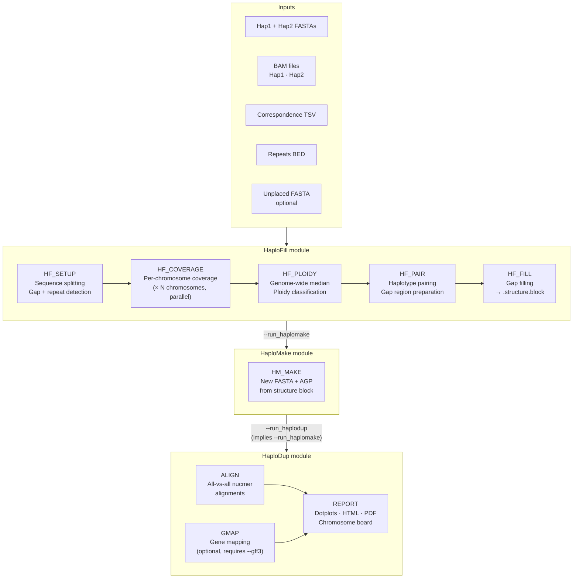

# Gap Filling workflow

**Entry point:** `nextflow/gap_fill.nf`

Fills assembly gaps in existing pseudomolecules using unplaced sequences guided by read coverage and ploidy classification. Optionally reconstructs a new assembly from the gap-fill result and runs HaploDup duplication QC.

---

## Workflow diagram



---

## Modules

### HaploFill module

The core gap-filling tool. Runs in five sequential steps. Always runs.

#### HF_SETUP

Splits the input FASTAs into per-sequence files, detects gaps, and parses repeat annotations.

- Creates the HaploFill temp directory structure with one subdirectory per sequence
- Identifies gap coordinates (N-stretches) in Hap1/Hap2 pseudomolecules
- Parses the repeat BED to mark regions unsuitable for gap filling
- Outputs: HaploFill temp directory (`{out}_tmp/`)

#### HF_COVERAGE

Computes read coverage for each sequence. **Runs in parallel** — one job per chromosome (one per haplotype sequence).

- Coverage is calculated against the corresponding BAM file (Hap1 BAM for Hap1 sequences, Hap2 BAM for Hap2 sequences)
- Two coverage backends are supported:
  - `bedtools` (default) — validated, ~40 min/chromosome
  - `mosdepth` (`--coverage_tool mosdepth`) — 20–50× faster, opt-in
- Cap parallel jobs in `nextflow.config` to avoid RAM exhaustion:
  ```
  process { withName: 'HF_COVERAGE' { maxForks = 8 } }   // ~48 GB RAM with bedtools
  ```
- Outputs: per-chromosome `.cov.txt.gz` (signal) and `.cov.bed.gz` (ranges)

#### HF_PLOIDY

Gather step — waits for all HF_COVERAGE jobs, then classifies ploidy across the genome.

- Calculates the genome-wide median coverage from all chromosomes
- Classifies each position as haploid / diploid / repetitive based on coverage thresholds
- Outputs: per-chromosome category BED files in `{out}_tmp/`

#### HF_PAIR

Prepares haplotype pairs and gap regions for filling.

- Links Hap1 ↔ Hap2 chromosome pairs using the correspondence file
- Identifies gap regions eligible for filling based on ploidy classification
- Outputs: updated temp directory

#### HF_FILL

Fills gaps by pulling in unplaced sequences.

- Aligns unplaced sequences to gap regions using minimap2
- Selects the best-fitting unplaced sequence for each gap based on coverage and ploidy
- Outputs: `{out}.structure.block` — the gap-fill structure file describing the patched assembly

---

### HaploMake module (optional)

Constructs a new FASTA and AGP from the HaploFill structure block. Runs with `--run_haplomake` or automatically when `--run_haplodup` is set.

#### HM_MAKE

- Reads the `.structure.block` produced by HF_FILL
- Concatenates sequences (original + gap-filling unplaced) into new pseudomolecules
- Optionally translates annotations and AGP coordinates into the new assembly space
- Outputs: `{out}.fasta`, `{out}.structure.agp`, `{out}.legacy_structure.agp`

---

### HaploDup module (optional)

Duplication and structural QC on the gap-filled assembly. Runs only with `--run_haplodup` (which automatically implies `--run_haplomake`). Can also be run standalone after gap filling with `-entry HAPLODUP`.

#### ALIGN

All-vs-all pairwise nucmer alignments between the gap-filled haplotypes.

- Detects duplicated regions introduced or resolved by gap filling
- Outputs: delta files used by REPORT

#### GMAP

Maps gene models onto the gap-filled pseudomolecules.

- Only runs when `--gff3` is provided and `--No2` is not set
- Identifies gene copy number imbalances between haplotypes
- Outputs: GFF3 files used by REPORT

#### REPORT

Generates the HaploDup HTML and PDF reports for the gap-filled assembly.

- Chromosome board: interactive overview of all haplotype pairs
- Per-chromosome dotplots
- Duplication/deletion candidate regions highlighted
- Outputs: HTML + PDF reports in `{outdir}/HaploDup/`

---

## Entry points

### Default: gap filling

```bash
nextflow run nextflow/gap_fill.nf -profile mamba -params-file params.yml
```

Runs: `HAPFILL → [HAPMAKE] → [HAPLODUP]`

### Standalone HaploDup (gap-fill context)

```bash
nextflow run nextflow/gap_fill.nf -entry HAPLODUP -profile mamba \
    --hapfill_hap1 hap1.fasta --hapfill_hap2 hap2.fasta \
    --hapfill_correspondence correspondence.tsv \
    --out myproject --outdir results
```

Reads HaploMake outputs from `{outdir}/HaploMake/` automatically.

---

## Parameters

### Required

| Parameter | Description |
|-----------|-------------|
| `--hapfill_hap1` | Hap1 FASTA (pseudomolecules to patch) |
| `--hapfill_hap2` | Hap2 FASTA (pseudomolecules to patch) |
| `--hapfill_correspondence` | Chromosome correspondence TSV |
| `--hapfill_repeats` | Repeats BED file |
| `--hapfill_b1` | BAM file aligned to Hap1 (`.bai` index must be present alongside) |
| `--hapfill_b2` | BAM file aligned to Hap2 (`.bai` index must be present alongside) |

### Optional inputs

| Parameter | Default | Description |
|-----------|---------|-------------|
| `--hapfill_unplaced` | — | Unplaced sequences FASTA |
| `--hapfill_coverage` | auto | Per-base coverage threshold |
| `--hapfill_flanking` | auto | Flanking region size (bp) |
| `--hapfill_map_threads` | 4 | Threads for minimap2 alignment |
| `--hapfill_nohomozygous` | false | Skip homozygous gap filling |

### Coverage tool

| Parameter | Default | Description |
|-----------|---------|-------------|
| `--coverage_tool` | `bedtools` | Coverage backend: `bedtools` \| `mosdepth` |

`mosdepth` is 20–50× faster than `bedtools` and produces equivalent output. It is opt-in pending broader validation.

### HaploMake options

| Parameter | Default | Description |
|-----------|---------|-------------|
| `--run_haplomake` | false | Build new FASTA/AGP from gap-fill result |
| `--hapmake_prefix` | — | Sequence ID prefix |
| `--hapmake_agp` | — | AGP reference for legacy coordinate mapping |
| `--hapmake_gff3` | — | Gene annotation GFF3 to translate |
| `--hapmake_bed` | — | BED file to translate |
| `--hapmake_gap` | 1000 | Gap size in bp |
| `--hapmake_skipoverlap` | false | Skip overlap trimming |
| `--hapmake_noagp` | false | Skip AGP output |
| `--hapmake_unplaced` | — | Override unplaced sequences FASTA |

### HaploDup

| Parameter | Default | Description |
|-----------|---------|-------------|
| `--run_haplodup` | false | Run HaploDup on the gap-filled assembly (implies `--run_haplomake`) |
| `--gff3` | — | Gene annotation GFF3 for GMAP mapping |

### Output

| Parameter | Default | Description |
|-----------|---------|-------------|
| `--out` | `out` | Output files prefix |
| `--outdir` | `results` | Results directory |

### Resources

| Parameter | Default | Description |
|-----------|---------|-------------|
| `--cores` | 4 | CPU cores per process |

---

## Output files

HaploFill outputs are written to `{outdir}/HaploFill/`:

| File | Description |
|------|-------------|
| `{out}.structure.block` | Gap-fill structure file (always produced) |
| `{out}.findings` | Gap-fill summary statistics |

HaploMake outputs are written to `{outdir}/HaploMake/` (with `--run_haplomake`):

| File | Description |
|------|-------------|
| `{out}.fasta` | New gap-filled pseudomolecule FASTA |
| `{out}.structure.agp` | AGP structure of the new assembly |
| `{out}.legacy_structure.agp` | Lifted-over legacy AGP (if `--hapmake_agp`) |

HaploDup outputs are written to `{outdir}/HaploDup/` (with `--run_haplodup`).

---

## Examples

```bash
# Gap fill only — inspect .structure.block before building assembly
nextflow run nextflow/gap_fill.nf -profile mamba \
    --hapfill_hap1 hap1.fasta --hapfill_hap2 hap2.fasta \
    --hapfill_correspondence correspondence.tsv \
    --hapfill_repeats repeats.bed \
    --hapfill_b1 hap1.bam --hapfill_b2 hap2.bam \
    --out myproject --outdir results

# With mosdepth (faster coverage)
nextflow run nextflow/gap_fill.nf -profile mamba \
    --hapfill_hap1 hap1.fasta --hapfill_hap2 hap2.fasta \
    --hapfill_correspondence correspondence.tsv \
    --hapfill_repeats repeats.bed \
    --hapfill_b1 hap1.bam --hapfill_b2 hap2.bam \
    --coverage_tool mosdepth \
    --out myproject --outdir results

# Gap fill + build new assembly
nextflow run nextflow/gap_fill.nf -profile mamba \
    --hapfill_hap1 hap1.fasta --hapfill_hap2 hap2.fasta \
    --hapfill_correspondence correspondence.tsv \
    --hapfill_repeats repeats.bed \
    --hapfill_b1 hap1.bam --hapfill_b2 hap2.bam \
    --run_haplomake \
    --out myproject --outdir results

# Gap fill + build + HaploDup QC (--run_haplodup implies --run_haplomake)
nextflow run nextflow/gap_fill.nf -profile mamba \
    --hapfill_hap1 hap1.fasta --hapfill_hap2 hap2.fasta \
    --hapfill_unplaced unplaced.fasta \
    --hapfill_correspondence correspondence.tsv \
    --hapfill_repeats repeats.bed \
    --hapfill_b1 hap1.bam --hapfill_b2 hap2.bam \
    --run_haplodup \
    --out myproject --outdir results

# Using a params file
nextflow run nextflow/gap_fill.nf -profile mamba \
    -params-file nextflow/params_gap_fill.yml

# Resume after interruption
nextflow run nextflow/gap_fill.nf -profile mamba -resume \
    -params-file nextflow/params_gap_fill.yml

# HPC (SLURM)
nextflow run nextflow/gap_fill.nf -profile hpc \
    -params-file nextflow/params_gap_fill.yml
```
