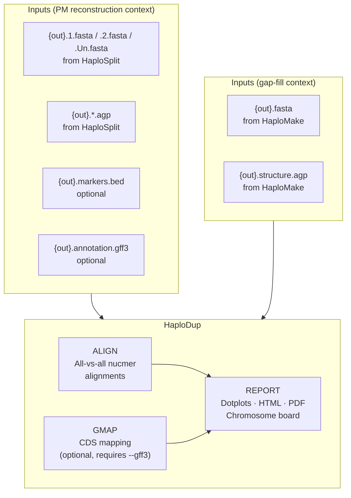

# HaploDup

**Entry point:** `nextflow/haplodup.nf`  
**Params template:** `nextflow/params_haplodup.yml`

Also available as a post-pipeline convenience entry point:
- `nextflow/reconstruct_pm.nf -entry HAPLODUP` — auto-reads HaploSplit outputs from `{outdir}/HaploSplit/`
- `nextflow/gap_fill.nf -entry HAPLODUP` — auto-reads HaploMake outputs from `{outdir}/HaploMake/`

Duplication and structural QC on a haplotype-resolved assembly. Produces per-chromosome dotplots, an HTML/PDF chromosome board, and gene copy-number imbalance reports.

---

## Workflow diagram



---

## Modules

### ALIGN

All-vs-all pairwise nucmer alignments between Hap1, Hap2, and unplaced sequences.

- Runs Hap1×Hap1, Hap2×Hap2, Hap1×Hap2, Hap2×Hap1 (and optionally vs a reference genome with `--reference`)
- Outputs delta files consumed by REPORT

### GMAP

Maps CDS sequences from a gene annotation onto both haplotypes.

- Only runs when `--gff3` is provided and `--No2` is not set
- Extracts CDS from the GFF3, builds GMAP indices, maps to both haplotypes
- Identifies gene copy-number imbalances between haplotype pairs
- Outputs: `CDS.on.genome.gmap.gff3`

### REPORT

Generates all HaploDup reports from the precomputed alignments and GMAP results.

- Per-chromosome dotplots (Hap1 vs Hap2)
- Chromosome board: interactive overview of all haplotype pairs
- Duplication and deletion candidate regions highlighted
- Hotspot windows for unbalanced gene content
- Outputs: `{out}.HaploDup_dir/` and optional `{out}.html` master index

---

## Entry points

### Standalone

```bash
nextflow run nextflow/haplodup.nf -profile mamba \
    --hap1_fasta hap1.fasta --hap2_fasta hap2.fasta \
    --correspondence correspondence.tsv \
    --out myproject --outdir results
```

### After PM reconstruction (convenience)

Reads outputs automatically from `{outdir}/HaploSplit/`. The following files are used when present:

| File | Description |
|------|-------------|
| `{out}.1.fasta` / `{out}.2.fasta` / `{out}.Un.fasta` | Pseudomolecule FASTAs |
| `{out}.*.agp` | AGP structure files |
| `{out}.markers.bed` | Marker positions (auto-detected) |
| `{out}.legacy_structure.agp` | Legacy AGP (auto-detected) |
| `{out}.annotation.gff3` | Gene annotation (auto-detected) |

```bash
nextflow run nextflow/reconstruct_pm.nf -entry HAPLODUP -profile mamba \
    --out myproject --outdir results
```

### After gap filling (convenience)

Reads the gap-filled FASTA from `{outdir}/HaploMake/`.

```bash
nextflow run nextflow/gap_fill.nf -entry HAPLODUP -profile mamba \
    --hapfill_hap1 hap1.fasta --hapfill_hap2 hap2.fasta \
    --hapfill_correspondence correspondence.tsv \
    --out myproject --outdir results
```

---

## Parameters

### Required

| Parameter | Description |
|-----------|-------------|
| `--out` | Output prefix (must match the upstream run) |
| `--outdir` | Results directory (must match the upstream run) |

For the gap-fill entry point only:

| Parameter | Description |
|-----------|-------------|
| `--hapfill_hap1` | Original Hap1 FASTA |
| `--hapfill_hap2` | Original Hap2 FASTA |
| `--hapfill_correspondence` | Chromosome correspondence TSV |

### Optional inputs

| Parameter | Description |
|-----------|-------------|
| `--gff3` | Gene annotation GFF3 for GMAP mapping |
| `--reference` | Reference genome for additional dotplots |
| `--markers_map` | Marker genetic map |
| `--functional_annotation` | Functional annotation per transcript |
| `--input_groups` | Sequence grouping file |
| `--legacy_groups` | Legacy component group file |

### Alignment thresholds

| Parameter | Default | Description |
|-----------|---------|-------------|
| `--hit_identity` | 90 | Min genome alignment identity (%) |
| `--hit_coverage` | 3000 | Min genome alignment length (bp) |
| `--gene_identity` | 95 | Min gene mapping identity (%) |
| `--gene_coverage` | 95 | Min gene mapping coverage (%) |
| `--unbalanced_ratio` | 0.33 | Gene count imbalance threshold |

### Gene mapping

| Parameter | Default | Description |
|-----------|---------|-------------|
| `--haplodup_feature` | `CDS` | GFF feature type: `CDS` \| `mRNA` |
| `--haplodup_window` | 10 | Window size for unbalanced gene search |
| `--haplodup_allowed` | 5 | Allowed unbalanced genes per window |

### Report options

| Parameter | Default | Description |
|-----------|---------|-------------|
| `--reuse_dotplots` | false | Reuse existing dotplot images |
| `--skip_dotplots_by_chr` | false | Skip per-chromosome dotplots |
| `--only_paired_dotplots` | false | Only generate matched-pair dotplots |

### Resources

| Parameter | Default | Description |
|-----------|---------|-------------|
| `--cores` | 4 | CPU cores per process |

---

## Output files

All outputs are written to `{outdir}/HaploDup/`:

| File | Description |
|------|-------------|
| `{out}.HaploDup_dir/` | Full HaploDup output directory |
| `{out}.HaploDup_dir/*.delta` | Nucmer delta files |
| `{out}.HaploDup_dir/CDS.on.genome.gmap.gff3` | GMAP mapping results (if `--gff3`) |
| `{out}.html` | Master index (if produced) |

---

## Examples

```bash
# After PM reconstruction — basic
nextflow run nextflow/reconstruct_pm.nf -entry HAPLODUP -profile mamba \
    --out myproject --outdir results

# After PM reconstruction — with reference genome and gene annotation
nextflow run nextflow/reconstruct_pm.nf -entry HAPLODUP -profile mamba \
    --out myproject --outdir results \
    --gff3 annotation.gff3 \
    --reference reference.fasta

# After gap filling
nextflow run nextflow/gap_fill.nf -entry HAPLODUP -profile mamba \
    --hapfill_hap1 hap1.fasta --hapfill_hap2 hap2.fasta \
    --hapfill_correspondence correspondence.tsv \
    --out myproject --outdir results

# Using a params file
nextflow run nextflow/reconstruct_pm.nf -entry HAPLODUP -profile mamba \
    -params-file nextflow/params_reconstruct_pm.yml

# HPC (SLURM)
nextflow run nextflow/reconstruct_pm.nf -entry HAPLODUP -profile hpc \
    -params-file nextflow/params_reconstruct_pm.yml
```
