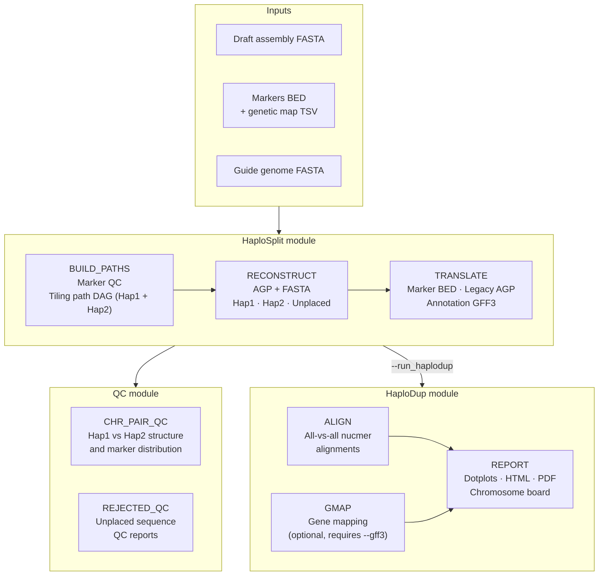

# PM Reconstruction workflow

**Entry point:** `nextflow/reconstruct_pm.nf`

Builds chromosome-scale pseudomolecules from a draft assembly, assigns sequences to haplotype(s), translates coordinates, and runs QC reports. Optionally runs HaploDup duplication QC on the output assembly.

---

## Workflow diagram



---

## Modules

### HaploSplit module

The core pseudomolecule reconstruction tool. Runs in three sequential steps.

#### BUILD_PATHS

Selects the optimal tiling paths for Hap1 and Hap2 from the draft assembly sequences.

- Runs marker QC to detect chimeric sequences and marker ploidy issues
- Constructs a directed acyclic graph (DAG) per chromosome from marker hits and/or guide genome alignments
- Selects the highest-coverage non-overlapping path for each haplotype
- Outputs: `{out}.hap1.list`, `{out}.hap2.list`, `{out}.unplaced.list`, `{out}.unused.list`

#### RECONSTRUCT

Builds the pseudomolecule FASTA and AGP files from the tiling paths.

- Concatenates draft sequences in tiling path order with defined gap sizes
- Assigns sequences not in any path to the unplaced FASTA
- Generates a correspondence table linking Hap1 ↔ Hap2 chromosomes
- Outputs: `{out}.1.fasta`, `{out}.2.fasta`, `{out}.Un.fasta`, `{out}.correspondence.tsv`, `{out}.*.agp`

#### TRANSLATE

Translates input coordinates (markers, AGP, annotation) into pseudomolecule space.

- Maps genetic markers to pseudomolecule positions → `{out}.markers.bed`
- Lifts over an existing AGP structure → `{out}.legacy_structure.agp`
- Transfers gene annotation GFF3 → `{out}.annotation.gff3`
- Skipped if none of `--markers`, `--input_agp`, or `--gff3` is provided

---

### QC module

Generates quality reports on the reconstructed assembly. Both reports run by default; each can be skipped independently. Both are skipped when `--No2` is set (no Hap2).

#### CHR_PAIR_QC

Per-chromosome Hap1 vs Hap2 overview reports.

- Shows sequence composition, gap positions, and marker distribution for each chromosome pair
- Outputs: one HTML report per chromosome pair in `{outdir}/HaploSplit/`

#### REJECTED_QC

QC reports for sequences assigned to a chromosome but not incorporated into the pseudomolecule.

- Shows alignment of unplaced sequences against the pseudomolecule they were assigned to
- Outputs: HTML reports in `{outdir}/HaploSplit/`

---

### HaploDup module (optional)

Duplication and structural QC on the reconstructed assembly. Runs only with `--run_haplodup`. Can also be run standalone after reconstruction with `-entry HAPLODUP`.

#### ALIGN

All-vs-all pairwise nucmer alignments between Hap1, Hap2, and unplaced sequences.

- Detects duplicated regions and structural inconsistencies between haplotypes
- Outputs: delta files used by REPORT

#### GMAP

Maps gene models from the translated annotation onto the pseudomolecules.

- Only runs when `--gff3` is provided and `--No2` is not set
- Identifies gene copy number imbalances between haplotypes
- Outputs: GFF3 files used by REPORT

#### REPORT

Generates the HaploDup HTML and PDF reports.

- Chromosome board: interactive overview of all haplotype pairs
- Per-chromosome dotplots (Hap1 vs Hap2)
- Duplication/deletion candidate regions highlighted
- Outputs: HTML + PDF reports in `{outdir}/HaploDup/`

---

## Entry points

### Default: pseudomolecule reconstruction

```bash
nextflow run nextflow/reconstruct_pm.nf -profile mamba -params-file params.yml
```

Runs: `HAPLOSPLIT → QC → [HAPLODUP]`

### Standalone HaploDup

```bash
nextflow run nextflow/reconstruct_pm.nf -entry HAPLODUP -profile mamba \
    --out myproject --outdir results
```

Reads HaploSplit outputs from `{outdir}/HaploSplit/` automatically.

### Standalone QC

```bash
nextflow run nextflow/reconstruct_pm.nf -entry QC -profile mamba \
    --out myproject --outdir results
```

Reads HaploSplit outputs from `{outdir}/HaploSplit/` automatically.

---

## Parameters

### Required

| Parameter | Description |
|-----------|-------------|
| `--input_fasta` | Draft assembly FASTA |
| `--markers` + `--markers_map` | Marker BED + genetic map TSV (at least one of markers/guide is required) |
| `--guide_genome` | Guide/reference genome FASTA (at least one of markers/guide is required) |

### Guide genome alignment

| Parameter | Default | Description |
|-----------|---------|-------------|
| `--run_alignment` | false | Run minimap2 to generate alignment |
| `--local_alignment` | — | Existing PAF file, skips minimap2 |
| `--mapping_tool` | `--cs -x asm20 -r 1000` | Minimap2 options string |
| `--distance1` | 2,000,000 | Max Hap1 sequence gap (bp) |
| `--distance2` | 4,000,000 | Max Hap2 sequence gap (bp) |
| `--hitgap` | 100,000 | Max gap to merge hits (bp) |
| `--reuse_intermediate` | false | Reuse existing nucmer files |

### Optional inputs

| Parameter | Description |
|-----------|-------------|
| `--input_agp` | Input AGP structure file |
| `--gff3` | Gene annotation GFF3 |
| `--exclusion` | Mutually exclusive sequence pairs (TSV) |
| `--known` | Sequences known to be in the same haplotype (TSV) |
| `--alternative_groups` | Alternative haplotype sequence pairs (TSV) |
| `--Require1` / `--Require2` | Sequences required in Hap1/Hap2 (TSV) |
| `--Blacklist1` / `--Blacklist2` | Blacklisted sequences for Hap1/Hap2 (TSV) |
| `--input_groups` | Sequence grouping file |
| `--legacy_groups` | Legacy component group file |
| `--path1` / `--path2` | Pre-defined tiling paths (skips DAG) |

### Assembly behaviour

| Parameter | Default | Description |
|-----------|---------|-------------|
| `--No2` | false | Skip Hap2 reconstruction |
| `--gap` | 1000 | Gap size in bp |
| `--filter_hits` | false | Remove seqs with intra-seq marker duplication |
| `--extended_region` | false | Extend sequence association to all chr markers |
| `--conflict_resolution` | — | Conflict resolution: `exit` \| `ignore` \| `release` |
| `--allow_rearrangements` | false | Allow rearrangements between haplotypes |
| `--required_as_path` | false | Treat `--R1`/`--R2` as full tiling paths |

### QC

| Parameter | Default | Description |
|-----------|---------|-------------|
| `--skip_chimeric_qc` | false | Skip chimeric sequence QC |
| `--disable_marker_ploidy_check` | false | Disable marker ploidy check |
| `--only_markers` | false | Limit rejected-seq QC to marker-bearing seqs |
| `--avoid_rejected_qc` | false | Skip QC of chr-assigned but unplaced seqs |
| `--skip_chr_pair_reports` | false | Skip chromosome pair overview reports |
| `--skip_unplaced_qc` | false | Skip unplaced sequence QC reports |

### HaploDup

| Parameter | Default | Description |
|-----------|---------|-------------|
| `--run_haplodup` | false | Run HaploDup after reconstruction |
| `--haplodup_opts` | — | Extra HaploDup flags as a quoted string |

### Output

| Parameter | Default | Description |
|-----------|---------|-------------|
| `--out` | `out` | Output files prefix |
| `--prefix` | `NEW` | Sequence ID prefix |
| `--outdir` | `results` | Results directory |

### Resources

| Parameter | Default | Description |
|-----------|---------|-------------|
| `--cores` | 4 | CPU cores per process |

---

## Output files

All outputs are written to `{outdir}/HaploSplit/`:

| File | Description |
|------|-------------|
| `{out}.1.fasta` | Hap1 pseudomolecule FASTA |
| `{out}.2.fasta` | Hap2 pseudomolecule FASTA |
| `{out}.Un.fasta` | Unplaced sequences FASTA |
| `{out}.correspondence.tsv` | Hap1 ↔ Hap2 chromosome correspondence |
| `{out}.1.agp` / `{out}.2.agp` / `{out}.Un.agp` | AGP structure files |
| `{out}.markers.bed` | Marker positions in pseudomolecule space (if `--markers`) |
| `{out}.legacy_structure.agp` | Lifted-over AGP structure (if `--input_agp`) |
| `{out}.annotation.gff3` | Translated annotation (if `--gff3`) |
| `{out}.unused_sequences.list` | Sequences not assigned to any pseudomolecule |
| `*.chr_pair.html` | Per-chromosome pair QC reports |
| `*.rejected_qc.html` | Unplaced sequence QC reports |

HaploDup outputs are written to `{outdir}/HaploDup/`.

---

## Examples

```bash
# Genetic map mode
nextflow run nextflow/reconstruct_pm.nf -profile mamba \
    --input_fasta assembly.fasta \
    --markers markers.bed \
    --markers_map genetic_map.tsv \
    --out myproject --outdir results

# Reference genome mode
nextflow run nextflow/reconstruct_pm.nf -profile mamba \
    --input_fasta assembly.fasta \
    --guide_genome reference.fasta --run_alignment \
    --out myproject --outdir results

# Combined (genetic map + guide genome)
nextflow run nextflow/reconstruct_pm.nf -profile mamba \
    --input_fasta assembly.fasta \
    --markers markers.bed --markers_map genetic_map.tsv \
    --guide_genome reference.fasta --run_alignment \
    --out myproject --outdir results

# Full pipeline with annotation translation and HaploDup
nextflow run nextflow/reconstruct_pm.nf -profile mamba \
    --input_fasta assembly.fasta \
    --markers markers.bed --markers_map genetic_map.tsv \
    --gff3 annotation.gff3 \
    --run_haplodup \
    --out myproject --outdir results

# Using a params file
nextflow run nextflow/reconstruct_pm.nf -profile mamba \
    -params-file nextflow/params_reconstruct_pm.yml

# Resume after interruption or manual curation
nextflow run nextflow/reconstruct_pm.nf -profile mamba -resume \
    -params-file nextflow/params_reconstruct_pm.yml

# HPC (SLURM)
nextflow run nextflow/reconstruct_pm.nf -profile hpc \
    -params-file nextflow/params_reconstruct_pm.yml
```
